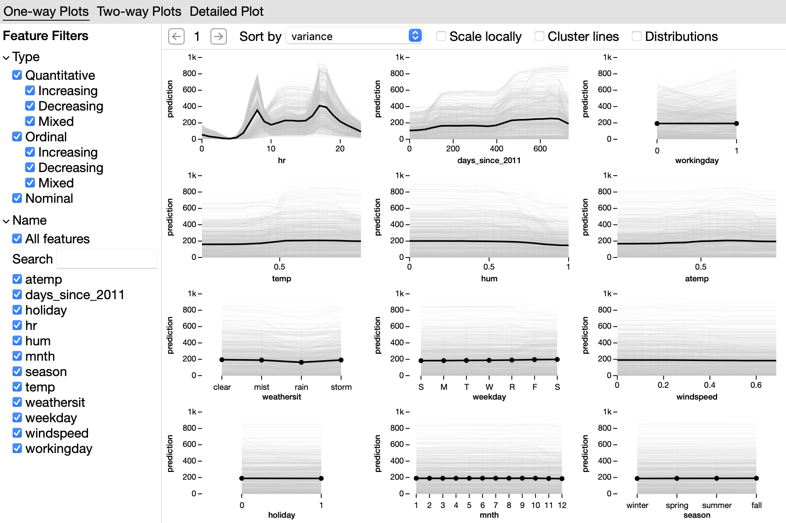

pdp-explorer
=====================================

pdp-explorer is a Jupyter widget for exploring partial dependence plots (PDPs) and individual conditional expectation (ICE) plots. You can find the code on `GitHub <https://github.com/nyuvis/pdp-ranking>`_.

Quickstart
----------

To get started, install with pip::

    pip install pdpexplorer

Or, you can try the widget in this `Colab notebook <https://colab.research.google.com/github/nyuvis/pdp-ranking/blob/main/examples/colab-example.ipynb>`_.

See the `example notebooks <https://github.com/nyuvis/pdp-ranking/tree/main/examples>`_ for more demonstrations.

.. toctree::
   :caption: User Guide

   usage
   api

.. toctree::
   :caption: Developer Guide

   developer-installation
   release
