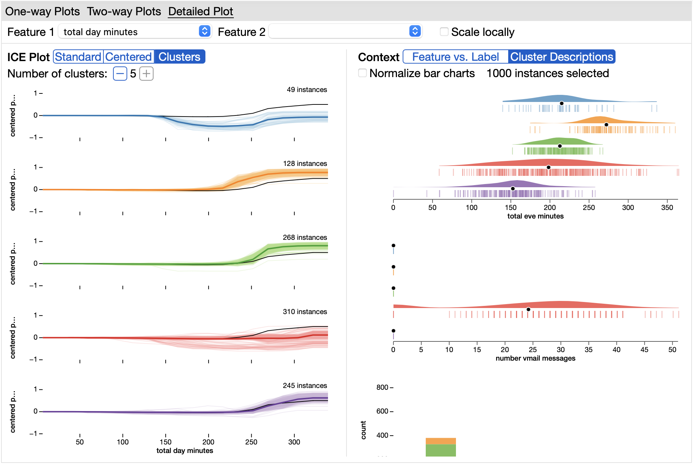

User Interface
==============

The UI is organized into three tabs: One-way Plots, Two-way Plots, and Detailed Plot.

One-way Plots
-------------

The One-way Plots tab shows a grid of `PDP <https://christophm.github.io/interpretable-ml-book/pdp.html>`_ + `ICE <https://christophm.github.io/interpretable-ml-book/ice.html>`_ plots, each containing one feature. Each plot shows the ICE lines in gray and the partial dependence line in black. Above each plot is a histogram showing the distribution of the feature's values in the dataset. In the row of controls at the top, the arrow buttons allow you to change pages. The “ICE” dropdown menu controls the type of visualization shown. The default is the standard ICE plot. Alternatively, you can show centered ICE plots, where all of the lines start at y = 0. Lastly, you can cluster the ICE lines and show the mean of each cluster. The “Scale locally” checkbox determines whether each plot has the same y-axis or each plot has its y-axis scaled to fit its own data. For normal ICE plots, scaling locally may not have any effect if the ICE lines already take up the full range of y-values.

Brushing the lines on an ICE plot highlights the lines for those instances across all of the plots. When you brush lines, the histograms update to show both the distribution of the highlighted instances and the distribution of the entire dataset. The green bars show the distribution of the highlighted instances. The transparent bars with black outline show the distribution of the entire dataset. The two plots are overlaid so that you can compare the highlighted distribution to the overall distribution.

The “Sort” dropdown menu controls how the plots are sorted. The one-way plots can be ranked according to one of several metrics:

* **Importance**: Ranks the plots in descending order of the average amount of variance in the y-values (model prediction) of their ICE lines. The plots that have more variation are ranked higher.
* **Cluster difference**: Ranks the plots in descending order of the total distance from the centers of the ICE line clusters to the partial dependence line. The plots that have more different clusters are ranked higher. This metric is paired best with the centered or clusters visualizations.
* **Highlighted line similarity**: Used in coordination with brushing ICE lines. This metric can be useful to identify if a cluster of instances in one plot is also a cluster in any others. Plots where the highlighted lines are closer together and farther from the partial dependence line are ranked first. The distances are computed on the centered ICE lines, so this metric is best paired with the centered ICE lines visualization. If you change the highlighted instances after selecting this metric, then clicking the refresh button next to the drop-down menu will update the rankings.
* **Highlighted histogram difference**: Used in coordination with brushing ICE lines. For each plot, this metric measures the distance between the distribution of feature values for the highlighted instances to the distribution for all instances. The plots are sorted in descending order so that the features whose highlighted distributions are most different from the overall distributions are ranked higher. If you change the highlighted instances after selecting this metric, then clicking the refresh button next to the drop-down menu will update the rankings.

On the left sidebar, you can filter the plots by the type of the feature, by the shape of the PDP, and by feature name. Ordered features have values with defined orders, such as temperature or day of the week. Nominal features have values without defined orders. For ordered features, you can filter by whether the feature's PDP is generally increasing, decreasing, or sometimes increasing and sometimes decreasing.

Two-way Plots
-------------

.. image:: screenshots/two-way-plots.png
  :width: 800
  :alt: Screenshot of the Two-way Plots tab in PDPilot.

The Two-way Plots tab shows a grid of PDPs, each containing two features. The default color scale visualizes the interactions between the pairs of features. A positive value indicates a positive interaction effect. This means that the features are interacting in a way that make the average prediction higher than expected if there was no interaction. A negative value indicates a negative interaction effect that lowers the model's average prediction compared to what would be expected with no interaction. Using the one-way PDPs for a given pair of features, we can calculate what the two-way PDP would look like if there was no interaction between the two features. We then visualize the difference between the the actual PDP and the calculated PDP with no interaction. Using the "Color" drop-down menu, you can change the color scale to "predictions" in order to show traditional two-way PDPs, where color encodes the model's average prediction.

The two-way plots can be ranked according to the following metrics:

* **Interaction**: This metric ranks the plots in descending order of `Friedman's H-statistic <https://christophm.github.io/interpretable-ml-book/interaction.html>`_.
* **Variance**: This metric ranks the plots in descending order of the amount of variance in the average predictions.

Detailed Plot
-------------

Hovering over any plot in the One-way Plots or Two-way Plots tab will reveal an expand button in the bottom-left corner of the plot. Clicking on this button will show this plot in the Detailed Plot tab. Alternatively, you can directly go to the Detailed Plot tab and choose which feature or pair of features you want to look at in more detail.

For a one-way plot, this tab shows two visualizations side-by-side. On the left is a visualization of the ICE plot and on the right is a visualization that provides more context. For the ICE plot, you can choose between a standard ICE plot, a centered ICE plot, and a clustered ICE plot. For standard and centered ICE plots, the context plot visualizes the feature values and ground truth labels.

In this tab, the “Clusters” visualization shows each cluster of ICE lines in its own plot. The ICE lines in each cluster are shown in lighter-colored lines. The mean of each cluster is shown in a darker-colored line. The partial dependence line is shown in black in each plot. In order to understand what kind of instances make up each cluster, you can change the context visualization to "Cluster Descriptions". This visualizes the distributions of the instances in each cluster for a handful of features. PDPilot automatically chooses features that are helpful in separating the clusters.

.. image:: screenshots/detailed-plot-two-way.png
  :width: 800
  :alt: Screenshot of the Detailed Plots tab in PDPilot for a two-way PDP.

For a two-way plot, the Detailed Plot tab shows the two-way PDP, the two-way interaction PDP, and a plot that visualizes the values of the two fetures and the ground truth labels. The corresponding one-way PDPs are shown in the margins of the two-way PDPs. Two-way plots are expensive to compute, so for efficiency, PDPilot only computes the two-way PDPs that it expects to show interaction. If you change the features in the Detailed Plot tab, the two-way PDP for the pair that you select may not have been pre-computed. In this case, you can click the “Compute Now” button to calculate the two-way PDP.
